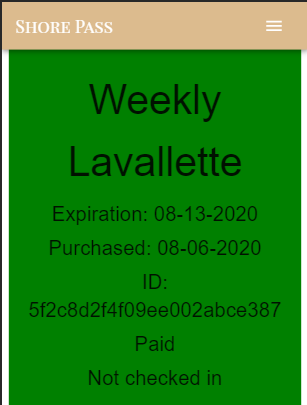

# Shore-Pass
Shore Pass allows you to easily find, purchase, view and present your beach tags right on your mobile device! No more losing or forgetting your tags at home! 

## Description

You can view the deployed application here at: https://shore-pass.herokuapp.com/

Shore Pass is the new convenient way to purchase and carry beach tags. 


QR Code made available instantly for fast access to the shore! 




## Technologies

* React JS
* JSX
* MongoDB
* Node / Express
* Javascript
* HTML / CSS

## Installation

To install necessary dependencies, run the following command:
```
npm install
```

## Usage

To start the React Application, run npm start

## Dependencies / Credits

* Axios
* React-Router
* Mongoose
* PassportJS
* Material-UI
* Google Charts: Infographics API
* Open Weather API

## Questions

If you have any questions about the repo, open an issue or contact ejlopez44.

## Contributors
Tito Lopez, Kevin Smeraglio, Kait O'Shaughnessy and Taneisha George.